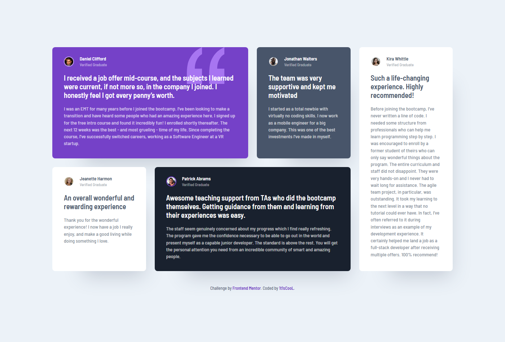

# Frontend Mentor - Testimonials grid section solution

This is a solution to the [Testimonials grid section challenge on Frontend Mentor](https://www.frontendmentor.io/challenges/testimonials-grid-section-Nnw6J7Un7). Frontend Mentor challenges help you improve your coding skills by building realistic projects.

## Table of contents

- [Overview](#overview)
    - [The challenge](#the-challenge)
    - [Screenshot](#screenshot)
    - [Links](#links)
- [My process](#my-process)
    - [Built with](#built-with)
- [Author](#author)

## Overview

### The challenge

- Build out the project to the designs provided

### Screenshot



### Links

- Solution URL: [Vercel](https://testimonials-grid-section-lilac-chi.vercel.app/)
- Live Site URL: [mmalabugin.ru/TestimonialsGridSection/](https://mmalabugin.ru/TestimonialsGridSection/)

## My process

### Built with

- Semantic HTML5 markup
- CSS custom properties
- CSS Grid (grid-template-areas)
- Mobile-first responsive layout
- [Vue 3](https://vuejs.org/) - JS framework (`<script setup>` + SFC)
- [Vite](https://vite.dev/) - build tool
- [TypeScript](https://www.typescriptlang.org/)

The project follows a Feature-Sliced Design layout (`app` / `pages` / `widgets` / `shared`),
mirroring the sibling projects in this repository. Testimonials are data-driven: a single
`TestimonialCard.vue` component is rendered from `testimonials.data.ts`.

## Author

- Website - [mmalabugin.ru](https://mmalabugin.ru/)
- Frontend Mentor - [@1t1sCooL](https://www.frontendmentor.io/profile/1t1sCooL)
- GitHub - [@1t1sCooL](https://github.com/1t1sCooL)
- Twitter - [@vi_el_mar](https://www.twitter.com/vi_el_mar)
- Telegram - [@ItIsCooL](https://t.me/ItIsCooL)

# Vue 3 + TypeScript + Vite

This template provides a minimal setup to get Vue 3 working in Vite with HMR.

## Recommended IDE Setup

[VSCode](https://code.visualstudio.com/) + [Vue - Official](https://marketplace.visualstudio.com/items?itemName=Vue.volar) (and disable Vetur).

## Scripts

```sh
npm install     # install dependencies
npm run dev     # start dev server
npm run build   # type-check and build for production
npm run preview # preview the production build
npm run lint    # run ESLint
```
